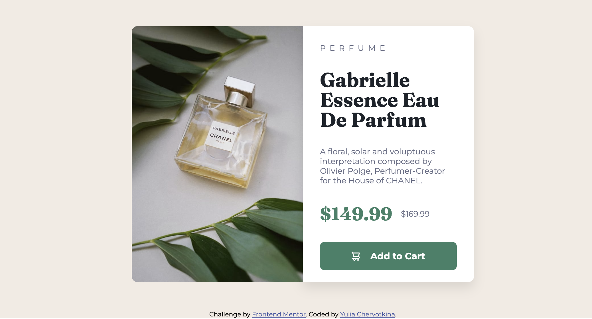

# Frontend Mentor - Product preview card component solution

This is a solution to the [Product preview card component challenge on Frontend Mentor](https://www.frontendmentor.io/challenges/product-preview-card-component-GO7UmttRfa).

## Table of contents

- [Overview](#overview)
  - [The challenge](#the-challenge)
  - [Screenshot](#screenshot)
- [My process](#my-process)
  - [Built with](#built-with)
  - [What I learned](#what-i-learned)
  - [Useful resources](#useful-resources)
- [Author](#author)

## Overview

### The challenge

Users should be able to:

- View the optimal layout depending on their device's screen size
- See hover and focus states for interactive elements

### Screenshot



## My process

### Built with

- Semantic HTML5 markup
- CSS custom properties
- Flexbox
- Adaptive Design (RWD)

### What I learned

```html

```

```css
button svg {
  fill: white;
}

:root {
  --main-bg-color: hsl(30, 38%, 92%);
  --info-bg-color: hsl(0, 0%, 100%);
  --price-and-button-color: hsl(158, 36%, 37%);
  /* and other variables */
}
```

### Useful resources

- [MDN](https://developer.mozilla.org/en-US/docs/Web/HTML/Responsive_images) - This helped me create an adaptive page.
- [W3school](https://www.w3schools.com/css/css3_buttons.asp) - This is an amazing resourse which helped me design an animated button.

## Author

- Website - (https://github.com/yulia-chervotkina)
- LinkedIn - (https://www.linkedin.com/in/yulia-chervotkina)
